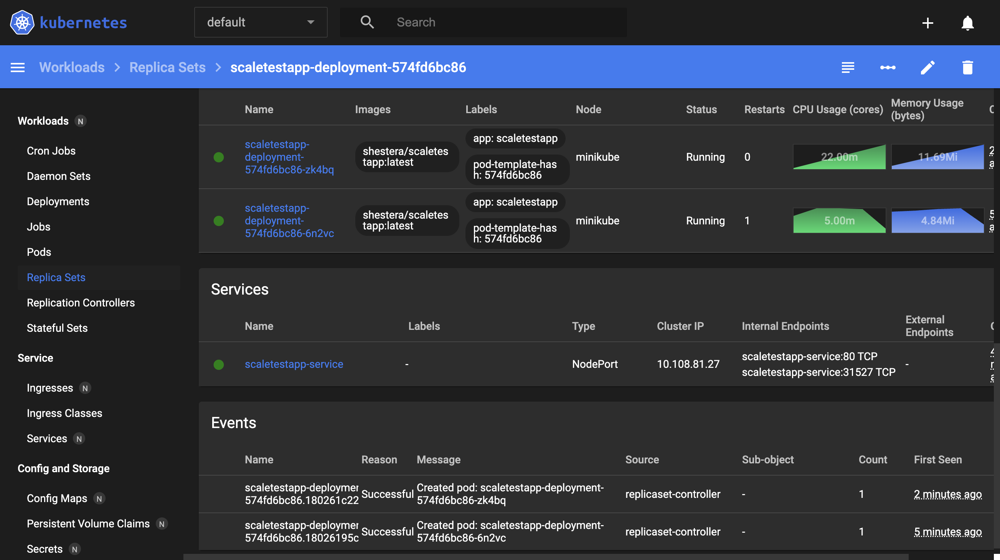

# Задание 2. Динамическое масштабирование контейнеров

https://kubernetes-sigs.github.io/metrics-server/
docker pull shestera/scaletestapp

```
minikube start --addons=metrics-server
kubectl apply -f deployment.yaml
kubectl apply -f service.yaml
kubectl apply -f hpa.yaml

minikube service scaletestapp-service --url
GET http://127.0.0.1:55629

locust
```


